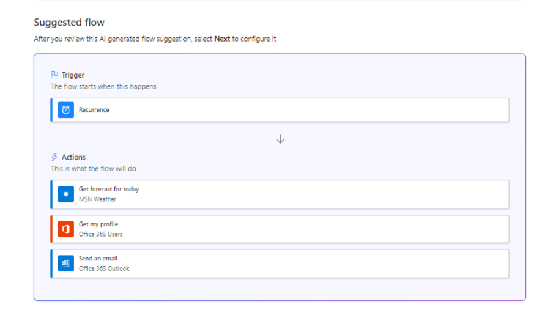
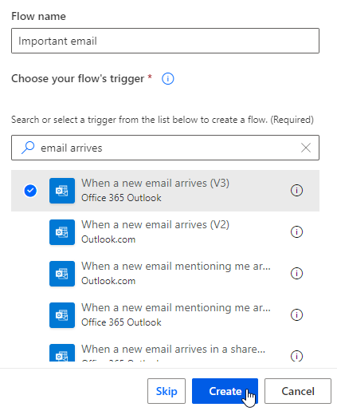

---
lab:
  title: "Laboratorio\_1: Crear flujos de nube."
  module: 'Module 1: Get started with Power Automate'
---

# Práctica de laboratorio 1: Creación de flujos de nube

En este laboratorio creará flujos de nube.

## Aprendizaje

- Creación de flujos de nube de Power Automate a partir de una plantilla y con Copilot
- Creación de un flujo de nube de Power Automate desde cero y adición de acciones

## Pasos de alto nivel del laboratorio

- Crear un flujo de nube a partir de una plantilla
- Creación de un flujo de nube con Copilot
- Crear un flujo de nube
- Supervisión de la actividad del flujo de nube
  
## Requisitos previos

- Debe de haber completado la práctica **Laboratorio 0: Validación del entorno de laboratorio**

## Pasos detallados

## Ejercicio 1: Creación de un flujo de nube a partir de una plantilla

### Tarea 1.1: Selección de una plantilla

1. Ve al portal de Power Automate `https://make.powerautomate.com`

1. Si aparece el cuadro de diálogo emergente **Le damos la bienvenida a Power Automate**, selecciona **Iniciar**.

1. Seleccione el entorno **Dev One**.

    

1. En el menú de la izquierda, seleccione la pestaña **Plantillas**.

1. Seleccione la pestaña **Botón**.

1. Escribe `location` en el campo **Buscar plantillas**.

    

1. Seleccione **Obtener previsión del tiempo de hoy para mi ubicación actual**.

    

1. En **MSN Weather**, seleccione **Crear**.

1. En **Notificaciones**, seleccione **Crear**.

1. Seleccione **Crear flujo**.

1. Si aparece el cuadro de diálogo emergente **Su flujo está listo para funcionar**, selecciona **No volver a mostrarme esto** y selecciona **Listo**.

    

### Tarea 1.2: Ejecución del flujo

1. Seleccione **Ejecutar**.

1. Si se le solicita, en **Conozca su ubicación**, seleccione **Permitir**.

1. Seleccione **Continuar**.

1. Seleccione **Ejecutar flujo**.

1. Seleccione **Listo**.

    

### Tarea 1.3: Revisión del flujo

1. Seleccione la fecha y hora en el historial de ejecución de flujos.

    

1. Seleccione el paso **Condición** para expandir los pasos del flujo.

    

1. Seleccione el paso **Obtener previsión para hoy** con el tic verde.

    

1. Seleccione **Editar**.

1. Seleccione el paso **Condición** para expandir los pasos del flujo.

1. Seleccione **Expandir condición**.

1. Seleccione uno de los pasos **Enviar una notificación de inserción**.

1. Seleccione **Comprobador de flujo**. No debería haber errores ni advertencias.

1. Cierre el panel **Comprobador de flujo**.

### Tarea 1.4: Prueba del flujo

1. Seleccione sucesivamente **Probar**, **Automáticamente**, **Con un desencadenador usado recientemente** y, luego, seleccione la ejecución del flujo.

    

1. Seleccione **Probar**.

1. En la parte superior izquierda de la barra de comandos, seleccione el botón **<-** Atrás.

## Ejercicio 2: Creación de un flujo de nube con Copilot

### Tarea 2.1: Inserción de una solicitud

1. Ve al portal de Power Automate `https://make.powerautomate.com` 

1. Asegúrese de que está en el entorno **Dev One**.

1. Seleccione la pestaña **Inicio** en el menú de la izquierda.

1. En **Vamos a automatizar algo. ¿Qué debe hacer?**, escribe `Every day send me an email with the daily summary from MSN Weather`.

    

1. Seleccione **Generar**.

    

1. Seleccione **Siguiente**.

1. Seleccione **Crear flujo**.

    

### Tarea 2.2: Configuración de los pasos del flujo

1. Seleccione el paso **Obtener previsión para hoy**.

1. En **Ubicación**, escriba `Seattle`.

1. Selecciona la **X** para borrar el contenido de **Unidades** y, en la lista desplegable, selecciona **Imperial**.

    

1. Seleccione **Guardar**.

1. Para probar el flujo, selecciona **Probar**, selecciona **Manualmente** y después **Ejecutar flujo**. Seleccione **Listo**.

1. En la parte superior izquierda de la barra de comandos, seleccione el botón **<-** Atrás.

## Ejercicio 3: Creación de un flujo de nube desde cero

### Tarea 3.1: Creación del desencadenador

1. Ve al portal de Power Automate `https://make.powerautomate.com`

1. Asegúrese de que está en el entorno **Dev One**.

1. Seleccione la pestaña **+ Crear** en el menú de la izquierda.

1. Seleccione **Flujo de nube automatizado**.

1. Escriba `Important email` en **Nombre de flujo**.

1. Escribe `email arrives` en el campo **Buscar todos los desencadenadores**.

1. Seleccione **Cuando llega un nuevo correo electrónico (V3)**.

    

1. Seleccione **Crear**.

### Tarea 3.2: Configuración del desencadenador

1. Seleccione el desencadenador **Cuando llega un nuevo correo electrónico (V3)**.

1. Seleccione **Mostrar todo**.

    

1. En **Incluir datos adjuntos**, seleccione **No**.

1. En **Importancia**, seleccione **Alta**.

1. En **Carpeta**, seleccione **Bandeja de entrada**.

### Tarea 3.3: Adición de una acción

1. Seleccione el icono **+** en el paso del desencadenador y elija **Agregar una acción**.

1. Escriba `notification` en el cuadro de búsqueda.

    

1. En **Microsoft Teams**, seleccione **Publicar una notificación de la fuente**.

1. Seleccione **Iniciar sesión**.

1. Use sus credenciales de inquilino.

1. En **Tipo de notificación**, seleccione **Equipo**.

1. En **Destinatario**, escriba el identificador de usuario del inquilino.

1. Escribe `/` en el campo **Texto de notificación** y selecciona **Insertar contenido dinámico**.

    

1. Seleccione **Asunto**.

1. En **Equipo**, seleccione **Contoso**.

1. En **Canal**, seleccione **General**.

1. Seleccione **Guardar**.

1. En la parte superior izquierda de la barra de comandos, seleccione el botón **<-** Atrás.

## Ejercicio 4: Supervisión de flujos

### Tarea 4.1: Actividad del flujo de nube

1. Ve al portal de Power Automate `https://make.powerautomate.com`

1. Asegúrese de que está en el entorno **Dev One**.

1. Seleccione **... Más** en el menú de la izquierda.

    

1. Seleccione el icono de anclaje para **Actividad de flujo de nube**.

1. En el menú de la izquierda, seleccione la pestaña **Actividad de flujo de nube**.

    

