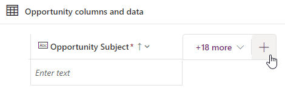

---
lab:
  title: "Laboratorio\_2: Modelo de datos"
  module: 'Module 2: Get started with Microsoft Dataverse'
---

# Laboratorio de práctica 2: Modelo de datos

En este laboratorio creará tablas y columnas de Dataverse.

## Aprendizaje

- Procedimiento para crear tablas y columnas en Microsoft Dataverse
- Procedimiento para crear una relación con una columna de búsqueda

## Pasos de alto nivel del laboratorio

- Crear una tabla personalizada
- Agregar columnas a la tabla
- Creación de una relación mediante una columna de búsqueda
  
## Requisitos previos

- Debe de haber completado la práctica **Laboratorio 0: Validación del entorno de laboratorio**

## Pasos detallados

## Ejercicio 1: Creación de tablas personalizadas

### Tarea 1.1: Creación de la tabla de oportunidades

1. Vaya al portal de Power Apps Maker `https://make.powerapps.com`.

1. Asegúrese de que está en el entorno **Dev One**.

1. Seleccione **Tablas** en el panel de navegación izquierdo.

1. Selecciona **+ Nueva tabla** y selecciona **Tabla (propiedades avanzadas)**.

    

1. En **Nombre para mostrar**, escriba `Opportunity`.

### Tarea 1.2: Columna principal

1. Selecciona la pestaña **Columna principal** situada junto a la pestaña **Propiedades**.

    

1. En **Nombre para mostrar**, escriba `Opportunity Subject`.

1. Seleccione **Guardar**.

### Tarea 1.3: Adición de columnas

1. En el panel **Columnas y datos de oportunidades**, seleccione **+** para agregar una nueva columna.

    

1. En el panel **Nueva columna**, escriba o seleccione los valores siguientes:

   1. Nombre para mostrar: `Owner Name`
   1. Tipo de datos: **Línea de texto única**
   1. Obligatorio: **Obligatorio para la empresa**

    

1. Seleccione **Guardar**.

1. En el panel **Columnas y datos de oportunidades**, seleccione **+** para agregar una nueva columna.

1. En el panel **Nueva columna**, escriba o seleccione los valores siguientes:

   1. Nombre para mostrar: `Customer`
   1. Tipo de datos: **Línea de texto única**
   1. Obligatorio: **Obligatorio para la empresa**

1. Seleccione **Guardar**.

1. En el panel **Columnas y datos de oportunidades**, seleccione **+** para agregar una nueva columna.

1. En el panel **Nueva columna**, escriba o seleccione los valores siguientes:

   1. Nombre para mostrar: `Address`
   1. Tipo de datos: **Línea de texto única**
   1. Obligatorio: **Opcional**

1. Expande **Opciones avanzadas** y escribe `200` para **Número máximo de caracteres**

1. Seleccione **Guardar**.

1. En el panel **Columnas y datos de oportunidades**, seleccione **+** y, en el panel **Nueva columna**, escriba o seleccione los valores siguientes:

   1. Nombre para mostrar: `Estimated Close Date`
   1. Tipo de datos: **Fecha y hora**
   1. Formato: **Solo fecha**
   1. Obligatorio: **Opcional**

1. Seleccione **Guardar**.

1. En el panel **Columnas y datos de oportunidades**, seleccione **+** y, en el panel **Nueva columna**, escriba o seleccione los valores siguientes:

   1. Nombre para mostrar: `Amount`
   1. Tipo de datos: **Moneda**
   1. Obligatorio: **Opcional**

1. Seleccione **Guardar**.

1. En el panel **Columnas y datos de oportunidades**, seleccione **+** y, en el panel **Nueva columna**, escriba o seleccione los valores siguientes:

   1. Nombre para mostrar: `Notes`
   1. Tipo de datos: **Varias líneas de texto**
   1. Formato: **Texto**
   1. Obligatorio: **Opcional**

1. Seleccione **Guardar**.

### Tarea 1.4: Adición de una columna de elección

1. En el panel **Columnas y datos de oportunidades**, seleccione **+** y, en el panel **Nueva columna**, escriba o seleccione los valores siguientes:

   1. Nombre para mostrar: `Status`
   1. Tipo de datos: **Elección** > **Elección**
   1. Obligatorio: **Opcional**

1. Seleccione **No** en **¿Sincronizar con opción global?**

1. Escriba `New` en **Etiqueta** y `1` en **Valor**.

1. Seleccione **+ Nueva opción** y escriba `Open` en **Etiqueta** y `2` en **Valor**.

1. Seleccione **+ Nueva opción** y escriba `Closed` en **Etiqueta** y `3` en **Valor**.

1. Seleccione **Nuevo** para **Opción predeterminada**.

    

1. Seleccione **Guardar**.

## Ejercicio 2: Creación de relaciones

### Tarea 2.1: Creación de una columna de búsqueda

1. Vaya al portal de Power Apps Maker `https://make.powerapps.com`.

1. Asegúrese de que está en el entorno **Dev One**.

1. Seleccione **Tablas** en el panel de navegación izquierdo.

1. Seleccione **Oportunidad**.

1. En el panel **Columnas y datos de oportunidades**, seleccione **+** y, en el panel **Nueva columna**, escriba o seleccione los valores siguientes:

   1. Nombre para mostrar: `Account`
   1. Tipo de datos: **Lookup**
   1. Obligatorio: **Opcional**
   1. Tabla relacionada: **Cuenta**

    

1. Seleccione **Guardar**.

## Ejercicio 3: Datos

### Tarea 3 1: Adición de registros de oportunidad

1. Vaya al portal de Power Apps Maker `https://make.powerapps.com`.

1. Asegúrese de que está en el entorno **Dev One**.

1. Seleccione **Tablas** en el panel de navegación izquierdo.

1. Seleccione **Oportunidad**.

1. En el panel **Columnas y datos de oportunidades**, seleccione el símbolo de intercalación desplegable situado junto a **Editar** y seleccione **Editar en una pestaña nueva**.

1. Introduzca o seleccione los siguientes valores:

   1. Asunto de la oportunidad: `100 Widgets`
   1. Nombre del propietario: `MOD Administrator`
   1. Cliente: `Adventure Works`
   1. Fecha de cierre estimada: **Elegir una fecha del mes anterior**
   1. Importe: `10,000`
   1. Estado: **Cerrado**

1. Seleccione **Insertar fila debajo** y escriba o seleccione los valores siguientes:

   1. Asunto de la oportunidad: `Key customer`
   1. Nombre del propietario: `MOD Administrator`
   1. Cliente: `Fabrikam`
   1. Fecha de cierre estimada: **Elegir una fecha futura del mes actual**
   1. Estado: **Nuevo**
   1. Importe: `50,000`

1. Seleccione **Insertar fila debajo** y escriba o seleccione los valores siguientes:

   1. Asunto de la oportunidad: `New customer`
   1. Nombre del propietario: `MOD Administrator`
   1. Cliente: `Coho Winery`
   1. Fecha de cierre estimada: **Elegir una fecha futura del mes siguiente**
   1. Importe: `25,000`
   1. Estado: **Nuevo**

1. Seleccione **Insertar fila debajo** y escriba o seleccione los valores siguientes:

   1. Asunto de la oportunidad: `Repeat customer`
   1. Nombre del propietario: `MOD Administrator`
   1. Cliente: `Fourth Coffee`
   1. Fecha de cierre estimada: **Elegir una fecha futura del mes siguiente**
   1. Importe: `15,000`
   1. Estado: **Abrir**

    

1. Cierre la pestaña.
