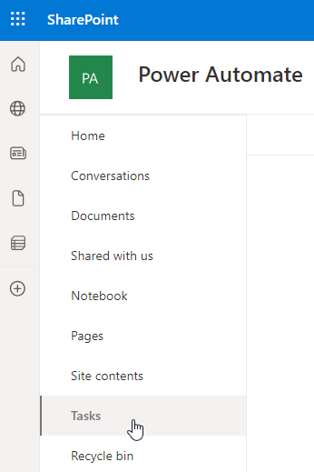
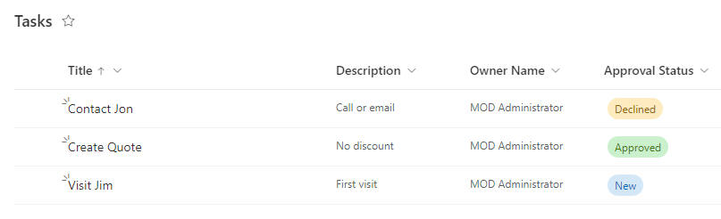

---
lab:
  title: 'Laboratorio 3: SharePoint'
  module: 'Module 3: Build approval flows with Power Automate'
---

# Laboratorio de práctica 3: SharePoint

En este laboratorio creará un sitio y una lista de SharePoint.

## Aprendizaje

- Cómo crear una lista de SharePoint
- Cómo cargar datos

## Pasos de alto nivel del laboratorio

- Crear una lista de SharePoint para oportunidades
  
## Requisitos previos

- Debe de haber completado la práctica **Laboratorio 0: Validación del entorno de laboratorio**

## Pasos detallados

## Ejercicio 1: Creación de una lista de SharePoint

### Tarea 1.1 Crear un sitio de SharePoint

1. En el portal de Creadores de Power Apps, `https://make.powerapps.com`

1. Selecciona el **iniciador de aplicaciones** en la parte superior izquierda de la ventana del explorador y luego selecciona **SharePoint**.

    

1. Si se muestra la **Página de inicio de bienvenida a SharePoint**, selecciona **X** para cerrar el cuadro de diálogo.

1. En SharePoint, seleccione **+Crear sitio**.

1. Seleccione **Sitio de grupo**, plantilla de **Equipo estándar** y **Usar plantilla**.

1. Escriba `Power Automate` para **Nombre del sitio** y seleccione **Siguiente**.

1. Seleccione **Crear sitio**.

1. Seleccione **Finalizar**.

1. Si se muestra el cuadro de diálogo emergente **Inicie el diseño de su sitio**, cierre el cuadro de diálogo.

### Tarea 1.2 Crear una lista de SharePoint

1. En el sitio de SharePoint, seleccione **+ Nuevo** y, a continuación, seleccione **Lista**.

    

1. Selecciona **Lista** en **Crear desde cero**.

1. Escriba `Tasks` en **Nombre** y seleccione **Crear**.

1. Seleccione **+ Agregar columna**, seleccione **Varias líneas de texto** y, luego, **Siguiente**.

1. En el panel **Crear una columna**, escriba o seleccione los valores siguientes:

   1. Nombre: `Description`
   1. Tipo: **Varias líneas de texto**

1. Seleccione **Guardar**.

1. Seleccione **+ Agregar columna**, seleccione **Texto** y, luego, **Siguiente**.

1. En el panel **Crear una columna**, escriba o seleccione los valores siguientes:

   1. Nombre: `Owner Name`
   1. Tipo: **Línea de texto única**

1. Seleccione **Guardar**.

1. Seleccione **+ Agregar columna**, seleccione **Fecha y hora** y, luego, **Siguiente**.

1. En el panel **Crear una columna**, escriba o seleccione los valores siguientes:

   1. Nombre: `Deadline`
   1. Tipo: **Fecha y hora**

1. Seleccione **Guardar**.

1. Seleccione **+ Agregar columna**, seleccione **Opción** y, luego, **Siguiente**.

1. En el panel **Crear una columna**, escriba o seleccione los valores siguientes:

   1. Nombre: `Approval Status`
   1. Tipo: **Opción**
   1. Opción 1=`New`
   1. Opción 2=`Approved`
   1. Opción 3=`Declined`

1. Seleccione **Nuevo** para **Valor predeterminado**

    

1. Seleccione **Guardar**.

1. Copie la primera parte de la dirección URL del sitio de SharePoint, por ejemplo, `https://m365x99999999.sharepoint.com/sites/PowerAutomate/`

## Ejercicio 2: Agregar lista de SharePoint de datos

### Tarea 2.1: Agregar datos

1. Vaya al sitio de SharePoint y seleccione la lista **Tareas**.

    

1. Selecciona **+ Agregar nuevo elemento**, escribe los datos siguientes y selecciona **Guardar**:

   1. Title=`Contact Jon`
   1. Description=`Call or email`
   1. Owner Name=`MOD Administrator`
   1. Deadline=**Yesterday**
   1. Approval Status=**Declined**

1. Selecciona **+ Agregar nuevo elemento**, escribe los datos siguientes y selecciona **Guardar**:

   1. Title=`Create Quote`
   1. Description=`No discount`
   1. Owner Name=`MOD Administrator`
   1. Deadline=**Today**
   1. Approval Status=**Approved**

1. Selecciona **+ Agregar nuevo elemento**, escribe los datos siguientes y selecciona **Guardar**:

   1. Title=`Visit Jim`
   1. Description=`First visit`
   1. Owner Name=`MOD Administrator`
   1. Deadline=**Tomorrow**
   1. Approval Status=**New**

    
