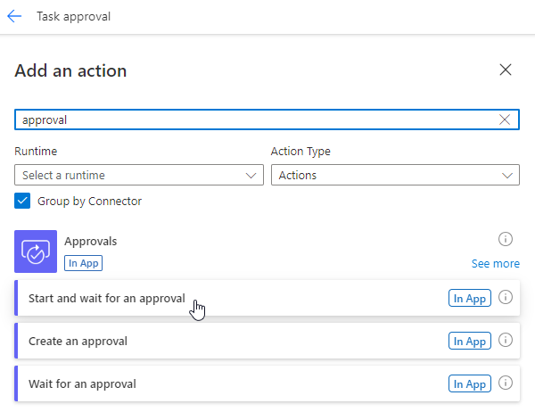
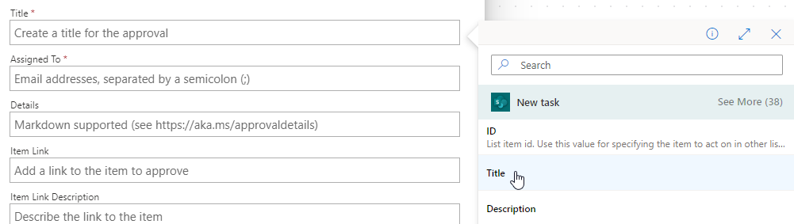
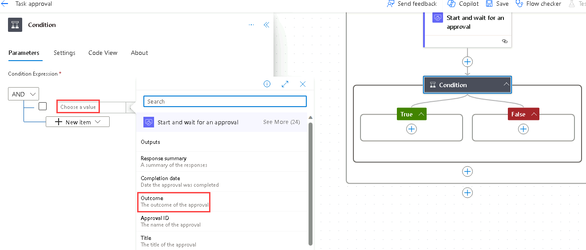
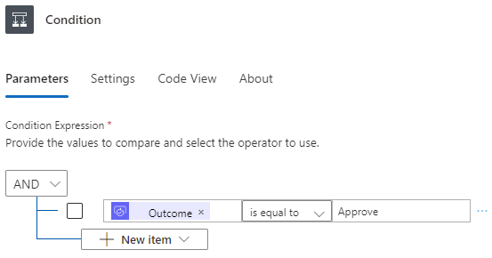

---
lab:
  title: "Laboratorio\_4: Flujo de aprobación"
  module: 'Module 3: Build approval flows with Power Automate'
---

# Práctica de laboratorio 4: flujo de aprobación

En este laboratorio, creará un flujo de aprobación.

## Aprendizaje

- Creación de un flujo de nube de aprobaciones de Power Automate

## Pasos de alto nivel del laboratorio

- Crear un flujo de nube automatizado para la lista de SharePoint
- Crear una aprobación
- Adición de una condición para el resultado de aprobación
- Prueba del flujo
  
## Requisitos previos

- Debe de haber completado la práctica **Laboratorio 3: SharePoint**

## Pasos detallados

## Ejercicio 1: Creación de un flujo de aprobación

### Tarea 1.1: Creación del desencadenador

1. Vaya al portal de Power Automate <https://make.powerautomate.com>.

1. Asegúrese de que está en el entorno **Dev One**.

1. Seleccione la pestaña **+ Crear** en el menú de la izquierda.

1. Seleccione **Flujo de nube automatizado**.

1. Escriba `Task approval` en **Nombre de flujo**.

1. Escriba `SharePoint` en el cuadro de búsqueda.

1. Seleccione **Cuando se crea un elemento**.

1. Seleccione **Crear**.

### Tarea 1.2: Configuración del desencadenador

1. Seleccione el paso **Cuando se crea un elemento**.

1. Seleccione **Cuando se crea un elemento** y escriba `New task`.

1. Seleccione el **sitio de SharePoint de Power Automate**.

1. Seleccione la lista **Tareas**.

    

### Tarea 1.3: Agregar acción de aprobación

1. Seleccione el icono **+** en el paso del desencadenador y elija **Agregar una acción**.

1. Escriba `approval` en el cuadro de búsqueda.

    

1. Seleccione **Iniciar y esperar una aprobación** en **Aprobaciones**.

1. Seleccione **Crear nuevo**.

1. Seleccione **Aprobar o rechazar: el primero en responder** al **tipo de aprobación**

1. Seleccione **Iniciar y esperar una aprobación*** y escriba `Approval`.

1. Seleccione el campo **Título** y seleccione el icono Contenido dinámico.

    

1. Seleccione **Título**.

1. Escriba el identificador de usuario del inquilino para **Asignado a**.

1. Seleccione el campo **Detalles** y seleccione el icono Contenido dinámico.

1. Seleccione **Descripción**.

1. Seleccione el campo **Vínculo de elemento**, el icono Contenido dinámico y **Ver más**.

1. Seleccione **Vincular al elemento**.

### Tarea 1.4: Agregar condición

1. Seleccione el icono **+** en el paso de aprobación y seleccione **Agregar una acción**.

1. Escriba `condition` en el cuadro de búsqueda.

1. Seleccione **Condición** en **Control**.

1. Seleccione **Guardar**.

1. En la parte superior izquierda de la barra de comandos, seleccione el botón **<-** Atrás.

1. Seleccione el campo **Elegir un valor** a la izquierda y seleccione el icono Contenido dinámico.

    

1. Seleccione **Resultado**.

1. Seleccione **es igual a** en **Operador**.

1. Seleccione el campo **Elegir un valor** a la derecha y escriba `Approve`.

    

### Tarea 1.5: Acciones de estado de actualización

1. Seleccione el icono **+** en **Verdadero** y seleccione **Agregar una acción**.

1. Escriba `update item` en el cuadro de búsqueda.

1. Seleccione **Actualizar elemento** en **SharePoint**.

1. Seleccione **Actualizar elemento** y escriba `Set task to approved`.

1. Seleccione el **sitio de SharePoint de Power Automate**.

1. Seleccione la lista **Tareas**.

1. Seleccione el campo **Id** y seleccione el icono Contenido dinámico.

1. Seleccione **Id** en **Nueva tarea**.

1. Seleccione **Mostrar todo**.

1. Seleccione el campo **Título** y seleccione el icono Contenido dinámico.

1. Seleccione **Título** en **Nueva tarea**.

1. Seleccione **Aprobado** en **Valor de estado de aprobación**.

1. Seleccione el icono **+** en **Falso** y seleccione **Agregar una acción**.

1. Escriba `update item` en el cuadro de búsqueda.

1. Seleccione **Actualizar elemento** en **SharePoint**.

1. Seleccione **Actualizar elemento 1** y escriba `Set task to declined`.

1. Seleccione el **sitio de SharePoint de Power Automate**.

1. Seleccione la lista **Tareas**.

1. Seleccione el campo **Id** y seleccione el icono Contenido dinámico.

1. Seleccione **Id** en **Nueva tarea**.

1. Seleccione **Mostrar todo**.

1. Seleccione el campo **Título** y seleccione el icono Contenido dinámico.

1. Seleccione **Título** en **Nueva tarea**.

1. Seleccione **Rechazar** en **Valor de estado de aprobación**.

1. Seleccione **Guardar**.

1. En la parte superior izquierda de la barra de comandos, seleccione el botón **<-** Atrás.

## Ejercicio 2: Aprobación de pruebas

### Tarea 2.1: desencadenamiento del flujo de aprobación

1. Vaya al sitio de SharePoint y seleccione la lista **Tareas**.

1. Seleccione **+ Nuevo**, escriba los datos siguientes y seleccione **Guardar**:

   1. Title=`Approval test`
   1. Description=`Test`
   1. Owner Name=`MOD Administrator`
   1. Deadline=**Today**
   1. Approval Status=**New**

### Tarea 2.2: Aprobación del progreso

1. Vaya al portal de Power Automate <https://make.powerautomate.com>.

1. Asegúrese de que está en el entorno **Dev One**.

1. Seleccione la pestaña **Mis flujos** en el menú de la izquierda.

1. Seleccione **Aprobación de tareas**.

1. Seleccione la fecha y hora en el historial de ejecución de flujos.

    > ** Nota: La funcionalidad Aprobaciones se instalará en segundo plano. Este proceso puede tardar 10 minutos, aproximadamente.

1. Seleccione la pestaña **Aprobaciones** en el menú de la izquierda.

    

1. Seleccione la **Prueba de aprobación**, seleccione el **Tic** y seleccione **Confirmar**.

1. Seleccione **Listo**.

1. Seleccione la pestaña **Mis flujos** en el menú de la izquierda.

1. Seleccione **Aprobación de tareas**.

1. Seleccione la fecha y hora en el historial de ejecución de flujos.

1. Vaya al sitio de SharePoint y seleccione la lista **Tareas**.

1. Compruebe que el **Estado de aprobación** del elemento de **prueba de aprobación** es **Aprobado**.
