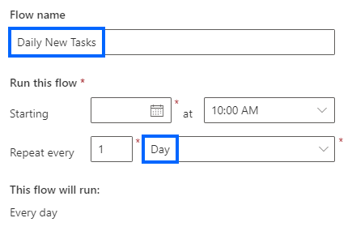
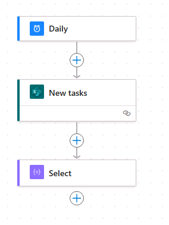

---
lab:
  title: 'Laboratorio 6: Flujo programado'
  module: 'Module 5: Power Automate’s deep integration across multiple data sources'
---

# Laboratorio de práctica 6: Flujo programado

En este laboratorio, creará un flujo programado.

## Aprendizaje

- Cómo crear un flujo programado de Power Automate y procesar una lista de elementos de SharePoint.

## Pasos de alto nivel del laboratorio

- Crear un flujo programado
- Consulta de la lista de SharePoint
- Usar operaciones de datos
- Prueba del flujo
  
## Requisitos previos

- Debe de haber completado la práctica **Laboratorio 3: SharePoint**

## Pasos detallados

## Ejercicio 1: Creación de un flujo programado

### Tarea 1.1: Creación del desencadenador

1. Ve al portal de Power Automate `https://make.powerautomate.com`

1. Asegúrese de que está en el entorno **Dev One**.

1. Seleccione la pestaña **+ Crear** en el menú de navegación de la izquierda.

1. Seleccione **Flujo de nube programado**.

1. Escriba `Daily New Tasks` en **Nombre de flujo**.

1. Establece **Repetir cada uno** en **1****día**.

    

1. Seleccione **Crear**.

### Tarea 1.2: Configuración del desencadenador

1. Seleccione el paso **Periodicidad**.

1. Selecciona el nombre del paso **Periodicidad** y escribe `Daily`.

### Tarea 1.3: Consulta de nuevas tareas

1. Seleccione el icono **+** en el paso del desencadenador y elija **Agregar una acción**.

1. Escriba `list items` en el cuadro de búsqueda.

1. Seleccione **Obtener elementos** en **SharePoint**.

1. Selecciona el nombre del paso **Obtener elementos** y escribe `New tasks`.

1. Seleccione el **sitio de SharePoint de Power Automate**.

1. Seleccione la lista **Tareas**.

1. En **Parámetros avanzados**, selecciona **Mostrar todo**.

1. Seleccione el campo **Consulta de filtro** y escriba `ApprovalStatus eq 'New'`

    

### Tarea 1.4: Seleccionar columnas

1. Selecciona el icono **+** bajo el paso **Nuevas tareas** y selecciona **Agregar una acción**.

1. Escriba `Select` en el cuadro de búsqueda.

1. Seleccione **Integrado** en **Runtime**.

1. Seleccions **Seleccionar** en **Operación de datos**.

1. Seleccione el campo **Desde** y seleccione el icono Contenido dinámico.

1. Seleccione **Cuerpo/valor** en **Nuevas tareas**.

1. Selecciona el campo **Escribir clave** y escribe `Task`

1. Seleccione el campo **Escribir clave** y seleccione el icono Contenido dinámico.

1. Seleccione **Título** en **Nuevas tareas**.

1. Selecciona el campo **Escribir clave** y escribe `Description`

1. Seleccione el campo **Escribir clave** y seleccione el icono Contenido dinámico.

1. Seleccione **Descripción** en **Nuevas tareas**.

1. Selecciona el campo **Escribir clave** y escribe `Due`

1. Selecciona el campo **Escribir valor**, selecciona el icono Contenido dinámico y selecciona **Ver más**.

1. Seleccione **Fecha límite** en **Nuevas tareas**.

    

1. Si el diseñador de flujos ha añadido automáticamente uno o varios bucles Cada uno, arrastre el paso Seleccionar fuera de los bucles y elimine el bucle o bucles.

    

### Tarea 1.5: Crear tabla

1. Seleccione el icono **+** en el paso Seleccionar y elija **Agregar una acción**.

1. Escriba `create html` en el cuadro de búsqueda.

1. Selecciona **Crear tabla HTML** en **Operación de datos**.

1. Selecciona el paso **Crear tabla HTML** y escribe `Format as HTML table`

1. Seleccione el campo **Desde** y seleccione el icono Contenido dinámico.

1. Seleccione **Salida** en **Seleccionar**.

    

### Tarea 1.6: Enviar correo electrónico

1. Selecciona el icono **+** bajo el paso **Formatear como tabla HTML** y selecciona **Agregar una acción**.

1. Escriba `email` en el cuadro de búsqueda.

1. Seleccione **Enviar un correo electrónico (V2)** en **Office 365 Outlook**.

1. Selecciona **Enviar un nombre de paso de correo electrónico (V2)** y escribe `Notify by email`

1. Seleccione el campo **Para** y seleccione **Escribir valor personalizado**.

1. Escriba el identificador de usuario del inquilino en **Para**.

1. Selecciona el campo **Asunto** y escribe `Daily Tasks`

1. Seleccione el campo **Cuerpo** y seleccione el icono Contenido dinámico.

1. Seleccione **Salida** en **Formato como tabla HTML**.

1. Seleccione **Guardar**.

## Ejercicio 2: Prueba del flujo programado

### Tarea 2.1: Ejecutar el flujo programado manualmente

1. Seleccione **Prueba**.

1. Seleccione **Manualmente**.

1. Seleccione **Probar**.

1. Seleccione **Ejecutar flujo**.

1. Seleccione **Listo**.

1. En el portal de Power Automate, seleccione el **Iniciador de aplicaciones** en la parte superior izquierda de la ventana del navegador y después seleccione **Outlook**.

    

