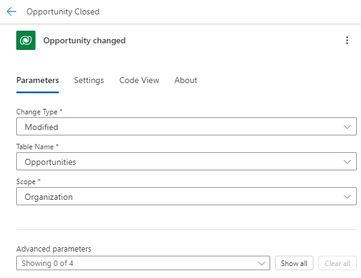

---
lab:
  title: 'Laboratorio 7: Filtros del desencadenador'
  module: 'Module 5: Power Automate’s deep integration across multiple data sources'
---

# Laboratorio de práctica 7: filtros de desencadenador

En este laboratorio se filtrará un desencadenador de actualización.

## Aprendizaje

- Cómo filtrar desencadenadores

## Pasos de alto nivel del laboratorio

- Crear un flujo automatizado
- Agregar filtro de columna
- Agregar filtro de consulta

## Requisitos previos

- Debe de haber completado la práctica **Laboratorio 2: Modelo de datos**

## Pasos detallados

## Ejercicio 1: Nombre del esquema

### Tarea 1.1: Nombre del esquema de columna

1. Vaya al portal de Power Apps Maker `https://make.powerapps.com`.

1. Asegúrese de que está en el entorno **Dev One**.

1. Seleccione **Tablas** en el panel de navegación izquierdo.

1. Seleccione **Oportunidad**.

1. En **Esquema**, seleccione **Columnas**.

1. Seleccione la columna **Estado**.

    

1. Expanda **Opciones avanzadas**.

    

1. Copia el **nombre lógico** para su uso en el flujo.

   > **Nota:** El prefijo de la columna de estado puede ser diferente.

## Ejercicio 2: Creación de un flujo automatizado

### Tarea 2.1: Creación del desencadenador

1. Ve al portal de Power Automate `https://make.powerautomate.com`

1. Asegúrese de que está en el entorno **Dev One**.

1. Seleccione la pestaña **+ Crear** en el menú de navegación de la izquierda.

1. Seleccione **Flujo de nube automatizado**.

1. Escriba `Opportunity Closed` en **Nombre de flujo**.

1. Escriba `Dataverse` en la búsqueda de todos los desencadenadores.

1. Seleccione **Cuando se agrega, modifica o elimina una fila**.

1. Seleccione **Crear**.

### Tarea 2.2: Configuración del desencadenador

1. Seleccione el paso **Cuando se agrega, modifica o elimina una fila**.

1. Selecciona el nombre del paso **Cuando se agrega, modifica o elimina una fila** y escribe `Opportunity changed`.

1. Seleccione **Modificado** para **Cambiar tipo**.

1. Selecciona **Oportunidades** para **Nombre de tabla**

1. Selecciona **Organización** para el **ámbito**.

    

### Tarea 2.3: enviar un mensaje de correo electrónico

1. Seleccione el icono **+** en el paso del desencadenador y elija **Agregar una acción**.

1. Escriba `email` en el cuadro de búsqueda.

1. Seleccione **Enviar un correo electrónico (V2)** en **Office 365 Outlook**.

1. Selecciona **Enviar un nombre de paso de correo electrónico (V2)** y escribe `Notify by email`

1. Seleccione el campo **Para** y seleccione **Escribir valor personalizado**.

1. Escriba el identificador de usuario del inquilino en **Para**.

1. Selecciona el campo **Asunto** y escribe `Opportunity closed`

1. Seleccione el campo **Cuerpo** y seleccione el icono Contenido dinámico.

1. Seleccione **Asunto de oportunidad** en **Oportunidad cambiada**.

1. Seleccione el campo **Cuerpo**, el icono Contenido dinámico y **Ver más**.

1. Seleccione **Estado** en **Oportunidad modificada**.

### Tarea 2.4: Filtro de columna

1. Seleccione el paso de desencadenador **Oportunidad cambiada**.

1. Seleccione **Mostrar todo**

1. Selecciona el campo **Seleccionar columnas** y escribe el **nombre lógico** del ejercicio anterior, por ejemplo: `cr977_status`

   > **Nota:** El prefijo de la columna de estado será diferente.

### Tarea 2.5: Filtro de fila

1. Seleccione el paso **Oportunidad cambiada**.

1. Seleccione **Mostrar todo**

1. Selecciona el campo **Filtrar filas** y escribe `cr977_status eq 3` con el **Nombre lógico** del ejercicio anterior.

    

    > **Nota:** El prefijo de la columna de estado será diferente.

1. Seleccione **Guardar**.

1. Selecciona el botón **<-****Atrás** de la parte superior izquierda de la barra de comandos.

